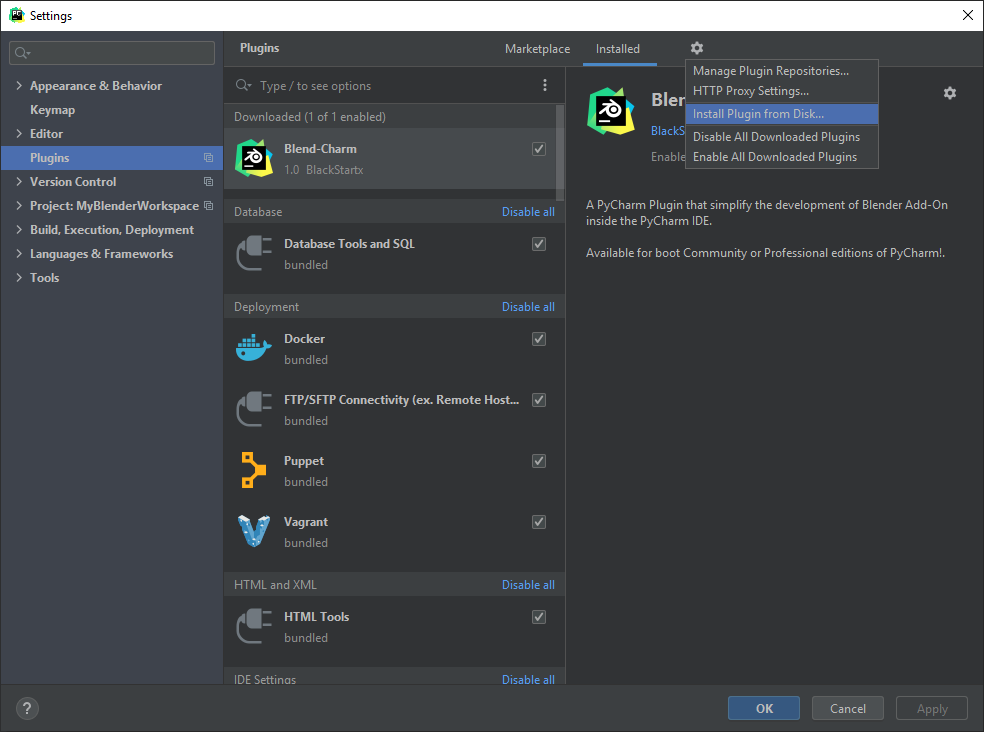
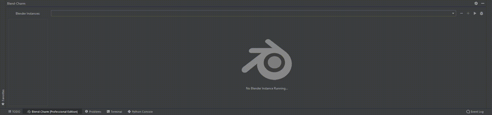
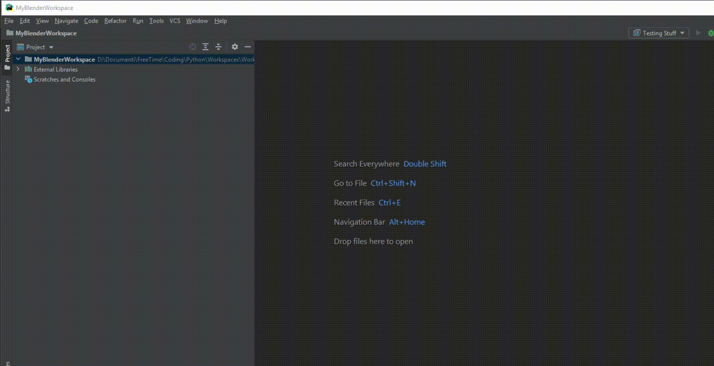
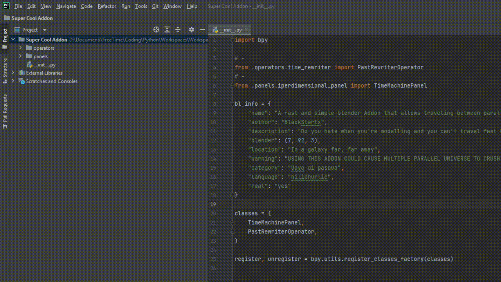

 

A PyCharm Plugin that simplify the development of Blender Add-On inside
the PyCharm IDE.

Available for both **Community** or **Professional** editions of PyCharm!

## How to Install

### Manual Installation

Simply choose from the release tab the version that suits your IDE Edition.

Once downloaded you can go to the Editor Settings (Ctrl + Alt + S) and select 
the tab "Plugins".

From there you can click the gear icon and: "Install Plugin from Disk..."

Select the downloaded file and PyCharm will install the Plugin!

### IntelliJ Marketplace Installation

>**_Right now, this plugin is not published on the IntelliJ Marketplace._**

The reason is that I do not think this plugin is good enough to fit in the 
Marketplace. 

Actually, I do not think it's ready for be public on GitHub too, but maybe 
even if it's not perfect, it could be useful for someone.

Maybe one day it will, and it will be the right way to install the plugin.

## Setting Up

### Configure Blender Executable

Once the plugin has been installed, you will find a new tab in the bottom of your
IDE called "Blend-Charm".

This tab will help you to launch Blender from your IDE,
keep tracking of console output and use all the feature of this plugin.

One of the important things you need to do once the plugin has started 
is setting-up your Blender Executable path!

You can do it by clicking on the '+' sign in the tab as shown in the gif
bellow.

Once you have configured the Blender Executable, you can start
creating your Blender Addon.

### Create your Blender Addon

You can create a brand-new Blender addon by Right-Clicking your
Project root and go:

- `New -> Blend-Charm -> Create New Blender Addon`

This will create all the minimum code required by a Blender Addon. 

### Understanding the project window.

All the addon in the project will have an icon of a folder and a small 
blender logo. 

**Those folders will automatically be installed as addons whenever 
you launch Blender from PyCharm.**

If for any reason your Addon Folder doesn't have that icon, it means it's
not marked as a Blender Addon Folder.
You can fix it by right-clicking it and go:

- `New -> Blend-Charm -> Mark as Addon Folder`

You can unmark a folder too, in the same way.

> Any addon must be the project **Root Folder** or a **Child** of it!  
> No other directory will be allowed to be marked as Blender Addons.

### Marking the project root as a Blender Addon.

Are you opening an existing add-on or do you just want to mark the whole project as a 
Blender Addon?

You can do it by right-clicking the project root folder and go:

- `New -> Blend-Charm -> Mark as Addon Project`

This way you cannot have other Blender Addons other than the project itself.

## Features:

**<li>[Auto-Install]</li>**

Blender will automatically install all the plugins in the current workspace.

**<li>[Update On Save]</li>**

The blender addon will reload with the new changes whenever 
you save it!

**<li>[Creation Templates]</li>**

Create a new Blender Addon, Panel or Operator easily by using the right click
menu.

**<li>[Debugging (Professional Edition-Only)]</li>**

Even if is still a lot buggy and crashy... you can run Blender in Debug-Mode 
and debug your code!

# Community or Professional?

This tool comes with two version:

- Community Edition
- Professional Edition

**Why so?**

PyCharm Professional Edition comes with a handy configuration 
called Remote Debugging.

This configuration is missing in the Community release.

As you guys can imagine that is a key piece for the Debug feature of this tool,
so, sadly, that feature can't work on Community Edition.

# Knew Issues

### ~~Debug shows an external file instead of the local one.~~

> This *should* have been fixed from 2023.1 onwards but it's using a "workaround".
> 
~~Sadly this issue has been reported on YouTrack multiple times, I think we 
shall wait a fix from IntelliJ Team.~~

- ~~https://youtrack.jetbrains.com/issue/PY-34001~~
- ~~https://youtrack.jetbrains.com/issue/PY-18491~~

### Run configuration console not printing.

By running Blender normally trough the plugin, the console is a little shy to print output buffers.

###### This issue is not present in Debug mode.

### Debug configuration crash.

If you are running in debug mode, and an exception is thrown by the code,
Blender will crash.

# Credits

This plugin is mainly inspired by 
"**[Blender Development](https://marketplace.visualstudio.com/items?itemName=JacquesLucke.blender-development)**"
of **Jacques Lucke**.

I used his great plugin until I started missing the PyCharm IDE I used to code 
in Python, so I decided to make my simple own version of it for PyCharm.

I never thought I would release it public.